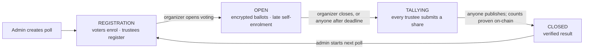

# BallotBox — private, verifiable polls on Midnight 🗳️

[](https://github.com/SATISH-JALAN/private-pooling/actions/workflows/ci.yaml)
[](https://github.com/SATISH-JALAN/private-pooling/actions/workflows/deploy.yaml)
[](#live-on-preprod)
[](./LICENSE)

**BallotBox** runs anonymous polls on the Midnight blockchain. Your ballot is encrypted
before it leaves your browser. A zero-knowledge proof shows you are allowed to vote without
revealing which voter you are. The final result is checked on-chain against the encrypted
ballots, so nobody has to trust the organizer.

| | |
|---|---|
| 🌐 **Live app** | **<https://REPLACE-WITH-VERCEL-URL>** |
| 📜 **Preprod contract** | `7423df36535c53ec590fd268f36771b9b9bd63ab741706062ac820f7b59f9351` ([deployment record](./deployments/preprod.json)) |
| 𝕏 **Product profile** | **[@REPLACE_WITH_HANDLE](https://x.com/REPLACE_WITH_HANDLE)** |
| 🎬 **Demo video** | [Watch the walkthrough](https://drive.google.com/drive/folders/17Wp-457jbYBe5BfflG4Z4f4I7z0sTcat?usp=sharing) |
| 💬 **Give feedback** | [Feedback form](https://github.com/SATISH-JALAN/private-pooling/issues/new?template=user-feedback.yml) · [how feedback is used](./docs/FEEDBACK.md) |
| 📖 **Docs** | [User guide](./docs/USER_GUIDE.md) · [Architecture](./docs/ARCHITECTURE.md) · [Privacy model](./PRIVACY.md) · [Deployment](./docs/DEPLOYMENT.md) · [Integration](./api/INTEGRATION.md) |

> **Try it in five minutes:** open the live app, follow *“New here?”*, press **Join this
> poll**, vote, then **Count me as a tester**. The [user guide](./docs/USER_GUIDE.md)
> walks through every step, including getting free test tokens.

---

## Contents

- [What This Product Does](#what-this-product-does)
- [Features](#features)
- [How a poll works](#how-a-poll-works)
- [Contract Address](#contract-address)
- [Live Demo](#live-demo)
- [Privacy Model](#privacy-model)
- [Live on Preprod](#live-on-preprod)
- [Prerequisites](#prerequisites) · [Setup & Run Locally](#setup--run-locally)
- [Usage](#usage)
- [Tech Stack](#tech-stack) · [Run Tests](#run-tests)
- [Project structure](#project-structure)
- [CI/CD](#cicd)
- [Performance](#performance)
- [Roadmap](#roadmap)
- [Troubleshooting](#troubleshooting)
- [Product Proposal](#product-proposal) · [Usage Guide](#usage-guide) · [Feedback & Iterations](#feedback--iterations)
- [Level 5 — User Validation](#level-5--user-validation) · [Level 6 Users](#level-6-users)
- [Product X Profile](#product-x-profile) · [Brand Assets](#brand-assets)
- [Contributing, security, license](#contributing-security-license)

---

## What This Product Does

Online voting usually forces a bad choice:

- **Trust a server.** The operator can see every vote, and can change the count.
- **Vote on a public blockchain.** Anyone can see how you voted, forever.

BallotBox uses Midnight's zero-knowledge smart contracts to avoid both. Each ballot stays
secret, and the result is still publicly verifiable. It suits DAO signalling, community
temperature checks, team retros and student councils: any vote where people should be free
to answer honestly.

## Features

| | Feature | What it means for you |
|---|---|---|
| 🔒 | **Secret ballots** | Your choice is encrypted (exponential ElGamal) and is never a public transaction input. Nobody can read an individual ballot, including the organizer. |
| 🕵️ | **Anonymous eligibility** | You prove membership of the voter roll in zero knowledge. The chain learns that *a* member voted, not which one. |
| ☝️ | **One counted ballot per voter** | Poll-bound nullifiers stop double voting without identifying anyone. |
| 🔁 | **Change your vote** | Re-voting replaces your earlier ballot. A receipt you were pressured to show proves nothing. |
| 🗝️ | **No single party can decrypt** | Threshold (n-of-n) trustees: every trustee must contribute a share before the result opens. |
| ✅ | **Verified results** | `publishTally` re-encrypts the claimed counts and checks them on-chain. Anyone can publish once the shares are in, and anyone can re-verify. |
| 🚪 | **Open or invite-only polls** | Public polls let people enrol themselves with one click. Binding votes use an organizer-managed roll. |
| ⏰ | **On-chain deadline & quorum** | Voting closes automatically. A poll that misses quorum is flagged as non-binding. |
| 👀 | **Preview without a wallet** | Invite links show the question, stage and turnout before you install anything. |
| 💾 | **Key backup & restore** | Your poll key survives reloads and can be exported, or imported from the CLI. |
| 🙋 | **Verifiable tester check-in** | An opt-in, on-chain participant list, kept separate from ballots. |

## How a poll works



1. **Create.** The contract admin (the deploying wallet) starts a poll, with an optional
   deadline, quorum, and **open enrollment**.
2. **Enrol.** Voters join with one transaction on open polls. On invite-only polls the
   organizer enrols pasted commitments. Each commitment is a one-way hash of a key that
   never leaves the voter's device.
3. **Register trustees.** One or more wallets register decryption keys. Their sum becomes
   the tally key, and nobody ever holds the matching secret.
4. **Vote.** The circuit proves roll membership, spends a nullifier, and adds an encrypted
   ballot to the running total.
5. **Close and decrypt.** Every trustee submits a proven decryption share.
6. **Publish.** Anyone recovers the counts from public data and submits them. The contract
   re-encrypts them and rejects anything that doesn't match the ballots.

## Contract Address

| Network | Address |
|---------|---------|
| Preprod | `7423df36535c53ec590fd268f36771b9b9bd63ab741706062ac820f7b59f9351` |

Deploy transaction and block: [`deployments/preprod.json`](./deployments/preprod.json).
Check it yourself, with no wallet: `npm run verify -- 7423df36535c53ec590fd268f36771b9b9bd63ab741706062ac820f7b59f9351`.

## Live Demo

<https://REPLACE-WITH-VERCEL-URL> — the featured poll runs on the contract above.

## Privacy Model

- **PUBLIC** (on-chain, anyone can see): the question, stage, deadline and quorum; the roll
  of anonymous voter commitments; the encrypted running tally; how many enrolled and how
  many voted; one unlinkable nullifier per ballot; the final counts once published; and the
  wallets that opted in to the tester list.
- **PRIVATE** (private witness, never on-chain): your secret key, your vote choice, and
  which entry on the voter roll is yours.
- **PROVED without revealing:** that you are on the roll (without saying which voter you
  are), that you have not already voted (without linking your ballots), that your ballot is
  a valid choice (without disclosing it), and that the published counts are exactly the
  decryption of the accumulated ballots (without opening any single ballot).

| Data | Visibility |
|---|---|
| Your vote choice | 🔒 **Private.** Encrypted, never a public input |
| Which enrolled voter cast a ballot | 🔒 **Private.** Zero-knowledge Merkle membership |
| Your secret key | 🔒 **Private.** Stays in your browser (back it up) |
| Poll question, stage, deadline, quorum | 🌐 Public |
| Turnout (ballots cast, voters enrolled) | 🌐 Public |
| Final counts | 🌐 Public, only after every trustee has contributed |
| Checked-in tester wallets | 🌐 Public, **opt-in**, and unlinked to ballots |

**Known limits** (details in [`PRIVACY.md`](./PRIVACY.md)):

- An observer can see *that* a voter re-voted, but not the choice.
- Open-enrollment polls are not Sybil-resistant.
- n-of-n trustees means one missing trustee blocks the result.

## Live on Preprod

| Item | Value |
|---|---|
| Network | Midnight **Preprod** |
| Contract address | `7423df36535c53ec590fd268f36771b9b9bd63ab741706062ac820f7b59f9351` |
| Deploy transaction | see [`deployments/preprod.json`](./deployments/preprod.json) |
| Web app | <https://REPLACE-WITH-VERCEL-URL> |
| Contract source | [`contract/src/private-polling.compact`](./contract/src/private-polling.compact) (Compact 0.23 / compiler 0.31.0) |
| Tester list | [`deployments/participants-preprod.json`](./deployments/participants-preprod.json) (regenerate with `npm run export-participants -- <address>`) |

Anyone can check the deployment and the result independently, with no wallet:

```bash
npm run verify -- <contract-address>               # re-derives and checks the published tally
npm run export-participants -- <contract-address>  # lists checked-in tester wallets
```

---

## Prerequisites

| Tool | Version | Notes |
|---|---|---|
| Node.js | **22+** (24 recommended, see `.nvmrc`) | `node -v` |
| Docker | any recent | runs the proof server |
| Compact compiler | **0.31.0** | Linux/macOS native; on **Windows it runs inside WSL** automatically |
| Browser wallet | [Lace (Midnight)](https://chromewebstore.google.com/detail/lace-midnight-preview/hgeekaiplokcnmakghbdfbgnlfheichg) or [1AM](https://chromewebstore.google.com/detail/1am/bphnkdkcnfhompoegfpgnkidcjfbojjp) | set to **Preprod** |

Install the Compact compiler (Linux/macOS):

```bash
curl --proto '=https' --tlsv1.2 -LsSf https://github.com/midnightntwrk/compact/releases/latest/download/compact-installer.sh | sh
compact update 0.31.0
```

On Windows you only need WSL with an Ubuntu distro, plus `unzip` inside it (`wsl -d Ubuntu -- apt-get install -y unzip`).
`npm run compact` installs the compiler inside WSL the first time.

## Setup & Run Locally

### 1 · Install, compile, test

```bash
git clone https://github.com/SATISH-JALAN/private-pooling.git
cd private-pooling
npm ci --legacy-peer-deps   # one install for all workspaces
npm run compact             # compile the contract → contract/src/managed (≈1 min)
npm run build               # contract → api → cli → ui
npm test                    # 65 tests: contract, api, ui
```

### 2 · Start the proof server

```bash
npm run proof-server        # docker: midnightntwrk/proof-server:8.0.3 on :6300
```

Point your wallet's proof server setting at `http://localhost:6300`, or use the wallet's
hosted prover if it offers one.

### 3 · Run the web app

```bash
npm run dev                 # http://localhost:5173 (Preprod)
```

To feature a poll on the landing page, create `private-polling-ui/.env.local` containing
`VITE_CONTRACT_ADDRESS=<address>` (see [`.env.example`](./private-polling-ui/.env.example)).
`npm run preview` serves the production build on <http://localhost:4173>.

### 4 · (Optional) Deploy your own contract from the terminal

```bash
cp private-polling-cli/.env.example private-polling-cli/.env   # add a funded Preprod wallet seed
npm run deploy
```

This writes a public record to `deployments/preprod.json`, and the organizer key to
`private-polling-cli/.secrets/` (gitignored). Import that key in the web app with the 🔑
button to manage the poll from a browser. Full guide: [docs/DEPLOYMENT.md](./docs/DEPLOYMENT.md).

---

## Usage

### As a voter
1. Open an invite link (`…/?poll=<address>`) or the featured poll, then **Connect wallet & take part**.
2. **Join this poll** (open polls). For invite-only polls, copy your commitment and send it to the organizer.
3. When voting is live, choose **Yes / No / Abstain**. Proving takes about 30–120 s. You can change your vote until it closes.
4. Optionally **Count me as a tester**, and press **Feedback**.

### As an organizer
1. **Deploy a new poll contract**. Your wallet becomes the admin. **Back up your key** (🔑).
2. **Start poll**: question, voting window, quorum, and open or invite-only.
3. **Become a trustee** (and invite others). At least one is required.
4. Enrol voters (invite-only), then **Open voting**. Share the invite link (📤).
5. **Close voting**. Trustees **submit shares**, then anyone presses **Publish the result**.

### From the CLI
`npm run cli` starts an interactive menu covering every circuit (create, enrol, self-enrol,
trustee, vote, close, share, publish, check-in). See [`private-polling-cli/README.md`](./private-polling-cli/README.md).

---

## Tech Stack

| Layer | What it uses |
|---|---|
| Contract | **Compact 0.23**, compiler **0.31.0**, `compact-runtime` 0.16, ledger-v8 |
| Proving | Midnight **proof-server 8.0.3** (Docker), circuit keys shipped with the app |
| Chain access | `midnight-js` 4.1.1 — indexer, node RPC, HTTP proof client |
| Web app | React 19, TypeScript, Vite 8, MUI, RxJS |
| Wallet | Midnight DApp connector API (Lace or 1AM) |
| CLI & tests | Node 24, vitest, testcontainers (node 0.22.3, indexer 4.0.1) |
| CI/CD | GitHub Actions → Vercel (prebuilt output) |

## Run Tests

```bash
npm test                  # contract (47) + api (5) + ui (13)
npm run e2e               # 26-step end-to-end poll on a local Midnight network (Docker)
npm run verify -- <addr>  # recheck a published tally from public chain data alone
```

## Project structure

```
private-pooling/
├── contract/                 Compact smart contract + simulator tests
│   └── src/private-polling.compact · witnesses.ts · test/
├── api/                      Shared TypeScript API (used by UI and CLI) + tally decryption
├── private-polling-ui/       React 19 + MUI web app (Vite) — deployed to Vercel
├── private-polling-cli/      Node CLI: interactive client, deploy, verify, export-participants
├── deployments/              Public deployment records and tester exports
├── docs/                     User guide, architecture, deployment, feedback loop, launch kit
├── scripts/                  Cross-platform Compact compile (WSL on Windows)
└── .github/workflows/        ci.yaml (test) · deploy.yaml (Vercel CD) · scan.yaml (security)
```

Architecture, data flow and design decisions: **[docs/ARCHITECTURE.md](./docs/ARCHITECTURE.md)**.

<details>
<summary>Where the challenge's suggested single-package layout lives here</summary>

This is an npm workspaces monorepo, because the contract, the shared API, the web app and
the CLI are built and published separately. The mapping:

| Suggested | Here |
|---|---|
| `contracts/*.compact` | [`contract/src/private-polling.compact`](./contract/src/private-polling.compact) |
| `managed/` | `contract/src/managed/private-polling/` (generated by `npm run compact`) |
| `src/components`, `src/hooks` | [`private-polling-ui/src/components`](./private-polling-ui/src/components), [`/hooks`](./private-polling-ui/src/hooks) |
| `src/utils/contract.ts` | [`api/src/index.ts`](./api/src/index.ts) — shared by the web app and the CLI |
| `tests/` | `contract/src/test/`, `api/src/test/`, `private-polling-ui/src/**/*.test.ts`, `private-polling-cli/src/e2e-standalone.ts` |
| `.github/workflows/ci.yml` | [`.github/workflows/ci.yaml`](./.github/workflows/ci.yaml) |
| `docs/USAGE.md` | [`docs/USAGE.md`](./docs/USAGE.md) |

</details>

## CI/CD

| Suite | Tests | Covers |
|---|---:|---|
| `contract` | 47 | lifecycle, admin gating, open/invite-only enrollment, historic roll, nullifiers, ElGamal tally, re-voting, threshold decryption, deadline/quorum, check-in isolation |
| `api` | 5 | end-to-end tally decryption from public ledger data (up to 70 voters) |
| `private-polling-ui` | 13 | key persistence across reloads, ballots never stored at rest, key backup/restore, input parsing, error mapping |
| **end-to-end** | 26 steps | a full poll with **real proofs and transactions** on a local Midnight network (Docker): deploy, open enrollment, late joining, encrypted votes, re-vote, rejections (duplicate enrolment, unenrolled voter, early close, non-admin), check-in, decryption share, permissionless verified publish, second poll |

Run the end-to-end suite with Docker running: `npm run e2e` (about 6 minutes; the first run
also pulls the node, indexer and proof-server images).

- **CI** ([`ci.yaml`](./.github/workflows/ci.yaml)) runs on every push and PR. On `main` it also runs the end-to-end poll on a local Midnight network. It compiles
  the contract with Compact 0.31.0, then runs typecheck, lint, build and test for all four
  packages, and checks that the web build ships its circuit keys.
- **CD** ([`deploy.yaml`](./.github/workflows/deploy.yaml)) builds the app with the
  compiled circuits and deploys to Vercel: previews for PRs, production for `main`.
- **Scan** ([`scan.yaml`](./.github/workflows/scan.yaml)) runs a daily security scan.

## Performance

Prover key size is a good proxy for proving cost (Compact 0.31.0):

| Circuit | Prover key | Notes |
|---|---:|---|
| `castVote` | 10.5 MB | Merkle path + nullifier + two EC encryptions |
| `createPoll` | 5.5 MB | resets every per-poll structure |
| `registerTrustee` / `submitDecryptionShare` | 2.9 MB | one or two scalar multiplications |
| `enrollVoter` / `selfEnroll` / `openVoting` / `closeVoting` | 2.7 MB | |
| `publishTally` | 0.34 MB | one re-encryption check |
| `checkIn` | 0.14 MB | cheapest — one set insert |

Tally decryption searches `(yes, no)` pairs bounded by turnout, which is O(n²/2). A
70-voter poll decrypts in a few seconds (tested). The roll holds up to 1024 voters (tree
depth 10).

## Roadmap

| Status | Item |
|---|---|
| ✅ | Merkle eligibility, nullifiers, encrypted tally, vote overriding, threshold decryption |
| ✅ | Admin-gated polls, open enrollment, historic roll, cross-poll unlinkability, tester check-in |
| ✅ | Persistent keys + backup, wallet-free preview, invite links, guided onboarding, feedback loop |
| 🔜 | Iterations driven by tester feedback — tracked in [docs/FEEDBACK.md](./docs/FEEDBACK.md) |
| 🔭 | Hide re-vote observability · t-of-n trustees · multi-option ballots · BSGS decryption for large rolls |

## Troubleshooting

| Problem | Fix |
|---|---|
| “No Midnight wallet found” | Install Lace (Midnight) or 1AM, switch it to **Preprod**, then reload |
| “Could not reach the proof server” | `npm run proof-server`, or choose a hosted prover in wallet settings |
| “Your wallet cannot pay the fee” | Get tNIGHT from the [faucet](https://faucet.preprod.midnight.network/), generate DUST, and wait a few minutes |
| Featured poll says “could not read” | The address is from an older contract version, or Preprod was reset. Deploy a fresh contract |
| Lost admin/trustee role after clearing the browser | Restore your key backup (🔑). Without a backup the role cannot be recovered |
| `npm run compact` fails on Windows | Install WSL + Ubuntu and `apt-get install unzip` inside it |
| Out of memory while deploying | `deploy-direct` already sets `--max-old-space-size=8192`; close other heavy apps |

More help: [SUPPORT.md](./SUPPORT.md) · [User guide FAQ](./docs/USER_GUIDE.md#faq).

## Product Proposal

What the product is, who uses it, why Midnight rather than a transparent chain, the data
model, and whether Mainnet is realistic: [PROPOSAL.md](./PROPOSAL.md).

## Usage Guide

[docs/USAGE.md](./docs/USAGE.md) — plain-English steps, including *Getting Started on
Preprod* and *Your First Transaction*. The longer walkthrough is the
[user guide](./docs/USER_GUIDE.md).

## Feedback & Iterations

Process, raw log and what changed because of it: [docs/FEEDBACK.md](./docs/FEEDBACK.md).

Top changes made before inviting testers (iteration 0):

- **Keys now survive a reload.** A page refresh used to mint a new secret key, which lost a
  voter's eligibility and could seal a poll permanently. Keys persist per poll, with backup
  and restore.
- **Anyone can join a public poll.** Voters had to hand their commitment to the organizer,
  which does not scale past a handful of testers. Open enrollment adds one-click joining.
- **Errors say what to do.** "Application is not authorized" became instructions about
  unlocking the wallet, switching to Preprod, or starting the proof server.

## Level 5 — User Validation

- Target: **50** Preprod users · Current: **0** — see [USERS.md](./USERS.md)
- Wallets come from the contract's participant set, exported from chain state:
  `npm run export-participants -- <address> && npm run sync-users`
- Feedback log and iterations: [docs/FEEDBACK.md](./docs/FEEDBACK.md)

## Level 6 Users

- Target: **70** Preprod users · Current: **0** — see [LAUNCH_USERS.md](./LAUNCH_USERS.md)
- Same export, same verification: the list is transcribed from the chain, not typed by hand.

## Product X Profile

**[@REPLACE_WITH_HANDLE](https://x.com/REPLACE_WITH_HANDLE)** — launch posts, brand brief
and recruitment messages are in the [launch kit](./docs/LAUNCH_KIT.md).

## Brand Assets

Palette, tagline, bio and banner concept: [launch kit § brand brief](./docs/LAUNCH_KIT.md#6-brand-brief).
Logo and banner images: _to be added_.

## Contributing, security, license

- Contributions are welcome. See [CONTRIBUTING.md](./CONTRIBUTING.md).
- Report vulnerabilities privately. See [SECURITY.md](./SECURITY.md).
- Changes are listed in [CHANGELOG.md](./CHANGELOG.md).
- Licensed under [Apache 2.0](./LICENSE). Built on the [Midnight](https://midnight.network) `example-bboard` scaffold.
