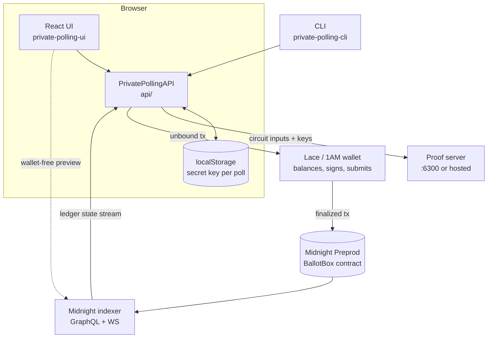
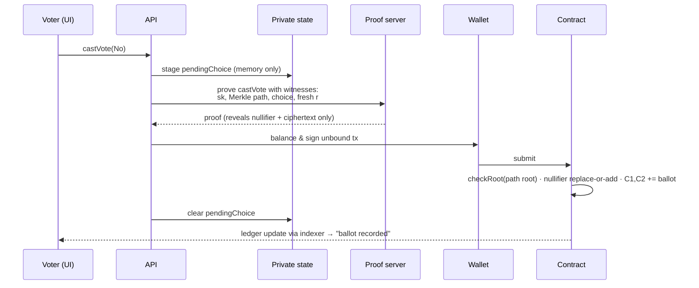
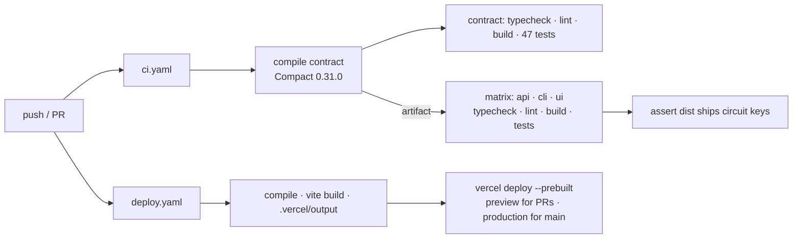

# Architecture

How BallotBox is built, how data moves through it, and why the main design decisions were
made. For the security argument itself, see [PRIVACY.md](../PRIVACY.md).

- [System overview](#system-overview)
- [Packages](#packages)
- [The contract](#the-contract)
- [Transaction flow: casting a ballot](#transaction-flow-casting-a-ballot)
- [Tally decryption](#tally-decryption)
- [Keys and private state](#keys-and-private-state)
- [Onboarding and user verification](#onboarding-and-user-verification)
- [Build and delivery](#build-and-delivery)
- [Design decisions](#design-decisions)

---

## System overview



- **Browser:** the UI and the shared API. Secret keys stay here.
- **Wallet:** balances and pays fees in DUST, signs, and submits. It never sees ballot contents.
- **Proof server:** builds zero-knowledge proofs from circuit inputs. Run it locally for the
  strongest privacy, because a remote prover sees those inputs.
- **Indexer:** streams public ledger state. The landing page reads it directly, so visitors
  can preview a poll without a wallet.

## Packages

| Package | Role | Key files |
|---|---|---|
| `contract/` | Compact contract, witnesses, simulator tests | `private-polling.compact`, `witnesses.ts`, `test/` |
| `api/` | The integration surface. UI and CLI do everything through it. Derives per-wallet state from the ledger and decrypts tallies | `index.ts`, `common-types.ts`, `tally.ts` |
| `private-polling-ui/` | React 19 + MUI app, bundled by Vite and hosted on Vercel | `hooks/usePollingContract.ts`, `components/poll/*`, `private-state/*` |
| `private-polling-cli/` | Interactive client, scripted deploy, verifier, participant export | `index.ts`, `deploy-direct.ts`, `verify-tally.ts`, `export-participants.ts` |

## The contract

**Lifecycle**

```
CLOSED ──createPoll (admin)──▶ REGISTRATION ──openVoting (owner)──▶ OPEN
   ▲                                                                   │
   └──────── publishTally (anyone, all shares in) ◀── TALLYING ◀── closeVoting
                                                     (owner, or anyone after deadline)
```

**Circuits**

| Circuit | Who | State | Effect |
|---|---|---|---|
| `constructor` | deployer | — | records `admin = H(sk, "0")` |
| `createPoll(q, deadline, quorum, open)` | admin | CLOSED | fresh `pollId = H(owner, previous pollId, "poll")`, and resets roll, ballots, trustees and tally |
| `registerTrustee()` | anyone | REGISTRATION | adds `g^xᵢ` to the joint key |
| `enrollVoter(c)` | owner | REGISTRATION | adds a commitment to the roll |
| `selfEnroll(c)` | anyone | REGISTRATION/OPEN, open polls only, before the deadline | adds the caller's commitment |
| `openVoting()` | owner | REGISTRATION | needs ≥1 trustee |
| `castVote()` | enrolled voter | OPEN, before the deadline | ZK membership + nullifier + ElGamal ballot (replaces any earlier one) |
| `closeVoting()` | owner, or anyone after the deadline | OPEN | → TALLYING |
| `submitDecryptionShare()` | trustee | TALLYING | proven `xᵢ·C1` |
| `publishTally(y, n, a)` | anyone | TALLYING, all shares in | re-encryption check, then publish |
| `checkIn()` | any wallet, once | any | adds the wallet's coin public key to `participants` |

**Ledger at a glance:** `admin`, `owner`, `pollId`, `pollState`, `openEnrollment`,
`eligibility: HistoricMerkleTree<10>`, `enrolledCommitments: Set`,
`priorBallotC1/C2: Map<nullifier, point>`, `encTallyC1/C2`, `tallyPublicKey`,
`trusteeKeys`, `decryptionShares`, `combinedShares`, `ballotCount`, `votingDeadline`,
`quorum`, `quorumMet`, `tallied`, `finalYes/No/Abstain`, `participants: Set`.

**Hash domains** are separated so one value can never stand in for another:
`derivedPublicKey(sk, "0")` identifies you, `voterCommitment = H(sk, "voter")` is your roll
entry, and `voteNullifier = H(H(sk, pollId), "nullifier")` is your per-poll ballot tag.

## Transaction flow: casting a ballot



The choice is a **witness**, not a circuit argument. A circuit argument would be a public
transaction input.

## Tally decryption

Each ballot encodes its choice as `m ∈ {1, 2¹⁶, 2³²}`. The homomorphic sum is
`g^(yes + no·2¹⁶ + abstain·2³²)` once blinded by `x·C1`. After every trustee submits
`xᵢ·C1`, `combinedShares = x·C1` is public, and
[`api/src/tally.ts`](../api/src/tally.ts) searches the `(yes, no)` pairs with
`yes + no ≤ ballotCount`, which fixes `abstain`. The contract then re-checks
`C2 == g^total + combinedShares`. The search needs no secret, so anyone can publish, and
anyone can verify with `npm run verify`.

## Keys and private state

| Where | Store | What is persisted |
|---|---|---|
| Browser | `localStorage`, key `ballotbox:v1:<network>:private-state:<contract>` | the 32-byte secret key only. A staged ballot is **memory-only** |
| CLI | LevelDB (`midnight-level-db`), encrypted with `PRIVATE_STATE_PASSWORD` | full private state |
| Backup | `ballotbox-key-backup/v1` JSON | `{ networkId, contractAddress, secretKey }`. Written by the UI and by `deploy-direct` |

One key per contract per browser. The same key acts as voter credential, organizer
authority and trustee share, which is why the UI puts backup and restore on every poll card.

## Onboarding and user verification

- **Invite links** (`?poll=<address>`) open a wallet-free preview read straight from the
  indexer ([`usePublicPollPreview`](../private-polling-ui/src/hooks/usePublicPollPreview.ts)).
- **Getting-started checklist** covers the usual first-run failures: no wallet, no tNIGHT
  or DUST, no prover.
- **Friendly errors** ([`friendly-errors.ts`](../private-polling-ui/src/lib/friendly-errors.ts))
  map wallet, prover and contract failures to a fix, and keep the raw cause for bug reports.
- **Tester check-in** is a separate on-chain set with no read or write path from any voting
  circuit, so the user count can be verified without touching ballot anonymity.
  `npm run export-participants` produces the list.

## Build and delivery



Vercel does not build the app itself, because the build needs the Linux-only Compact
compiler. CI builds it, packages a Build Output API directory
([`scripts/vercel-output.mjs`](../private-polling-ui/scripts/vercel-output.mjs)) and
deploys that prebuilt output. Git-triggered Vercel builds are switched off in `vercel.json`.

## Design decisions

| Decision | Why | Trade-off |
|---|---|---|
| Admin fixed at construction | Stops anyone taking over a CLOSED shared contract | Losing the admin key ends new polls on that contract, hence the key backup |
| `pollId` hash-chained per poll | The old owner-only id repeated nullifiers across polls and linked voters. Chaining avoids reading a counter in the transaction that increments it | none |
| Open enrollment is per poll | Public polls need one-click joining; binding votes need Sybil resistance | Open polls accept one person enrolling several keys |
| `HistoricMerkleTree` roll | Enrollments during OPEN would otherwise invalidate in-flight proofs | History grows with enrollments during a poll |
| n-of-n trustees | One honest trustee keeps the result sealed | One absent trustee blocks the result |
| Re-vote replaces the ballot | Receipts become worthless to a coercer | That a re-vote happened is visible |
| Check-in separate from voting | Verifiable usage without weakening anonymity | Checking in publishes a wallet key (opt-in) |
| Keys in localStorage + backups | Survives reloads with no server | Readable by scripts on the origin; the backup is user-managed |
