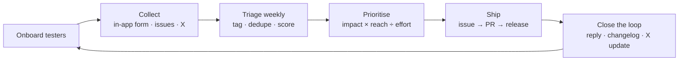

# Feedback loop

How BallotBox gathers feedback from Preprod testers, decides what to change, and closes
the loop. This document is the process. The [feedback log](#feedback-log) and
[iteration history](#iteration-history) below record what actually happened.

---

## 1. Collect

| Channel | What it captures | Where it lands |
|---|---|---|
| **In-app Feedback button** (every page) | Structured form: role, whether they voted, where they got stuck, ease (1–5), privacy understanding, top change | Google Form responses sheet (`VITE_FEEDBACK_URL`), or the [GitHub feedback issue form](https://github.com/SATISH-JALAN/private-pooling/issues/new?template=user-feedback.yml) |
| **GitHub issues** | Bugs and feature requests from technical users | Issues labelled `feedback` / `triage` |
| **X replies and DMs** | Informal reactions, confusion, requests | Copied into the log weekly |
| **On-chain signals** | Enrolments vs. ballots vs. check-ins (the drop-off funnel) | `npm run verify` / `export-participants` snapshots |

Every form uses the same core questions, so responses can be compared across iterations:

1. What did you do? (voter / organizer / trustee / CLI)
2. Did you manage to cast a vote? If not, where did you get stuck?
3. How easy was it, 1–5?
4. Did you understand why your vote stays private?
5. What should we change first?

## 2. Triage (weekly)

For each new item:

1. **Tag** it with one area: `onboarding`, `wallet`, `proving`, `voting-ux`, `organizer`,
   `docs`, `privacy`, or `bug`.
2. **Dedupe** it into an existing theme, and increment that theme's *reach* (how many testers raised it).
3. **Classify** it as `blocker` (couldn't complete a vote), `friction` (completed, but it was
   confusing or slow), or `idea`.

## 3. Prioritise

Score each theme and work top-down:

**Priority = Impact × Reach ÷ Effort**

| Score | Impact | Reach | Effort |
|---|---|---|---|
| 3 | Blocks voting | ≥ 25% of respondents | ≤ ½ day |
| 2 | Causes drop-off or confusion | 10–25% | ≤ 2 days |
| 1 | Nice to have | < 10% | > 2 days |

Hard rules that override the score:

- A **privacy or security** issue always goes first, whatever its reach.
- A **blocker** reported by 3 or more testers goes into the next iteration.
- Anything that changes the contract needs a redeploy, so batch those changes.

## 4. Ship

Each accepted theme gets a GitHub issue that links its log rows, one PR referencing the
issue, updated docs in the same PR, and a `CHANGELOG.md` entry.

## 5. Close the loop

- Reply on the issue or thread: “fixed in vX.Y, thanks for reporting”.
- Post a short *“You asked, we shipped”* update on X each iteration.
- Record the before/after metric in the iteration history.

## Metrics tracked per iteration

| Metric | Source |
|---|---|
| Testers checked in (verified wallets) | `npm run export-participants` |
| Enrolled → voted conversion | contract `enrolledCommitments` vs `ballotCount` |
| % of respondents who completed a vote | form Q2 |
| Median ease score | form Q3 |
| % who understood the privacy model | form Q4 |

---

## Feedback log

Add one row per distinct piece of feedback. Link the source, and never paste wallet seeds
or key files.

| # | Date | Source | Area | Type | Summary | Theme / issue | Status |
|---|---|---|---|---|---|---|---|
| 1 | YYYY-MM-DD | form | onboarding | blocker | *example: “didn't know I needed DUST”* | #— | open |

## Iteration history

### Iteration 0: pre-launch hardening (internal review, before external testers)

Found by testing the full flow end-to-end before inviting users:

| Finding | Change | Result |
|---|---|---|
| Reloading the page generated a new secret key, so enrolled voters lost eligibility and trustees could seal a poll forever | Keys persist per poll in localStorage, with backup and restore | Covered by UI tests |
| Publishing a result always failed: the tally search compared curve points with `JSON.stringify`, which throws on `bigint` | Compare points by coordinates | 70-voter end-to-end decryption test |
| Voters had to hand-copy commitments to the organizer, which can't scale to 50+ testers | Per-poll open enrollment with one-click **Join this poll** | Contract tests for open, invite-only and late joining |
| Anyone could take over the shared demo contract between polls | Admin fixed at deployment | Contract test |
| The same voter produced the same nullifier in every poll by one organizer | `pollId` hash-chained from the previous poll | Contract test |
| Errors like “Application is not authorized” gave no hint of the fix | Friendly error mapping and a first-run checklist | UI tests |
| No poll could be created on a real network: the proof server rejected `createPoll` because curve-point resets differed between circuit and runtime | Reset points to a computed identity | End-to-end run on a local network |
| No first vote could be proven: an unused lookup produced an off-curve point | Branch-free ballot replacement with an identity sentinel | End-to-end run: 26/26 steps pass |

### Iteration 1: *after the first 15–20 testers*

| Theme | Reach | Priority | Change shipped | Metric before → after |
|---|---|---|---|---|
| | | | | |

### Iteration 2: *after 50 testers (Level 5)*

| Theme | Reach | Priority | Change shipped | Metric before → after |
|---|---|---|---|---|
| | | | | |
